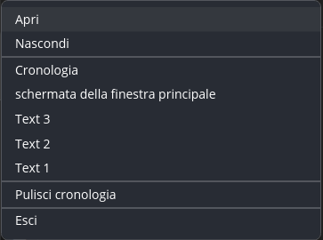
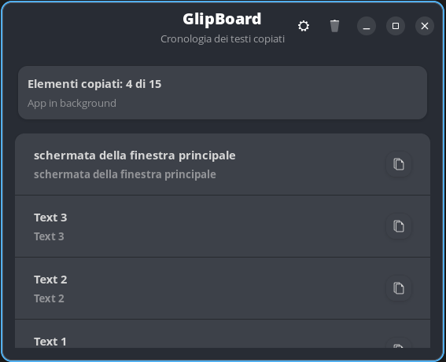
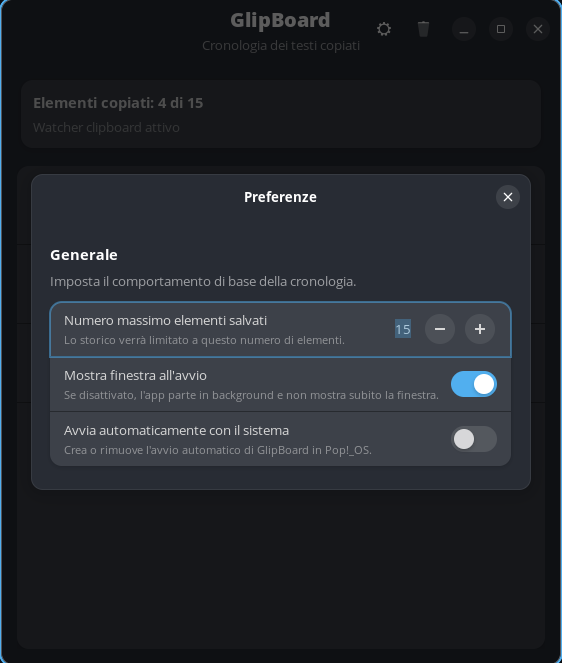

# GlipBoard

GlipBoard is a desktop clipboard manager for Pop!_OS.

It keeps a history of copied text, lets you browse previous entries in a clean GTK interface, and allows you to copy any saved item back to the clipboard with a single click.


## Overview

GlipBoard is designed for a practical Linux desktop workflow on Pop!_OS, with a focus on:

- reliable text clipboard history on Wayland
- a simple main window for browsing copied items
- a tray integration for quick access
- lightweight local storage for history and settings
- a packaging path that works both for development and public distribution

## Features

- Monitors copied text on Wayland
- Stores a local history of recent clipboard items
- Restores any saved text back to the clipboard with one click
- Provides a GTK4/libadwaita main window
- Includes a tray helper for quick access
- Supports basic preferences such as maximum saved items and startup behavior
- Supports local installation and Debian package generation

## Tech Stack

- Python 3
- GTK4 + libadwaita
- `wl-clipboard`
- `AyatanaAppIndicator3`

## Requirements

Install the main dependencies on Pop!_OS:

```bash
sudo apt update
sudo apt install python3 python3-gi python3-gi-cairo gir1.2-gtk-4.0 gir1.2-adw-1 wl-clipboard xclip gir1.2-ayatanaappindicator3-0.1
```

If you use the tray integration on GNOME/Pop!_OS, make sure AppIndicator support is enabled in your desktop environment.

GlipBoard uses `wl-clipboard` on Wayland and `xclip` on X11 sessions.

## Recommended Installation

The recommended way to install GlipBoard is to download the `.deb` package from the GitHub `Releases` page.

After downloading the package:

```bash
sudo apt install ./glipboard_<version>_all.deb
```

This installs GlipBoard like a normal end-user application and makes it available from the system application launcher.

## Build the `.deb` Package

If you want to build the Debian package from the repository:

```bash
chmod +x scripts/build-deb.sh
npm run build-deb
```

The generated package will be created at:

```text
dist/glipboard_0.1.1_all.deb
```

To install the package locally:

```bash
sudo apt install ./dist/glipboard_0.1.1_all.deb
```

The `.deb` build installs the application under `/usr/share/glipboard`, adds the `glipboard` launcher, and registers the desktop entry for the system.

## Development

To run GlipBoard directly from the repository:

```bash
npm start
```

This starts:

- the main GTK window
- the clipboard watcher based on `wl-paste`
- the tray helper process

## Local Installation From the Repository

This option is mainly useful for development and local testing, not as the primary installation path for end users.

To add GlipBoard to your user applications:

```bash
chmod +x scripts/install-local.sh scripts/uninstall-local.sh
./scripts/install-local.sh
```

This creates:

- a desktop launcher in `~/.local/share/applications/glipboard.desktop`
- a startup script in `~/.local/share/glipboard/run-glipboard.sh`
- a reference to `image (2).png` as the application icon

To remove the local installation:

```bash
./scripts/uninstall-local.sh
```

To reinstall it:

```bash
./scripts/uninstall-local.sh
./scripts/install-local.sh
```

## Usage

1. Launch GlipBoard.
2. Copy text normally from any application.
3. Open the main window or use the tray menu.
4. Select an item from the history to copy it back to the clipboard.

## System Shortcut

If you want a reliable keyboard shortcut to bring GlipBoard back to the foreground, use a system-level shortcut instead of an app-managed global hotkey.

Recommended command:

```bash
glipboard
```

Suggested shortcut:

```text
Super+V
```

Typical setup path on Pop!_OS or Ubuntu:

1. Open `Settings`
2. Go to `Keyboard`
3. Open `Keyboard Shortcuts`
4. Add a custom shortcut
5. Set command to `glipboard`
6. Assign your preferred key combination

Behavior:

- if GlipBoard is not running, command starts it
- if GlipBoard is already running, command asks existing instance to show its window

## Screenshots

### Tray



### Main Window



### Preferences



## Local Data

GlipBoard stores its local application data in:

```text
~/.local/share/glipboard/
```

During development, if `.glipboard-data/` already exists in the project directory, GlipBoard continues to use it for compatibility. In the installed application, it uses the standard user data directory.

## Project Structure

- `gtk_app.py`: main GTK4/libadwaita application
- `tray_helper.py`: separate tray helper based on AppIndicator
- `scripts/build-deb.sh`: Debian package build script
- `scripts/install-local.sh`: local desktop installation script
- `scripts/uninstall-local.sh`: local installation removal script
- `scripts/wl-watch-event.sh`: clipboard event handling via `wl-paste`

## Release Status

GlipBoard is already usable on Pop!_OS and has been tested as an installable `.deb` package. The current public release is:

- `v0.1.1` in preparation
- `v0.1.0` currently public

Related documents:

- `CHANGELOG.md`
- `docs/releases/0.1.0.md`
- `docs/releases/0.1.1.md`

## Roadmap

- continue polishing the public repository presentation
- improve documentation and onboarding
- expand screenshots and release materials
- evaluate additional packaging options over time

## Repository

GitHub repository:

`https://github.com/CavalloGianni/GlipBoard`

## Author

Gianni Cavallo

## License

MIT. See [LICENSE](LICENSE).
